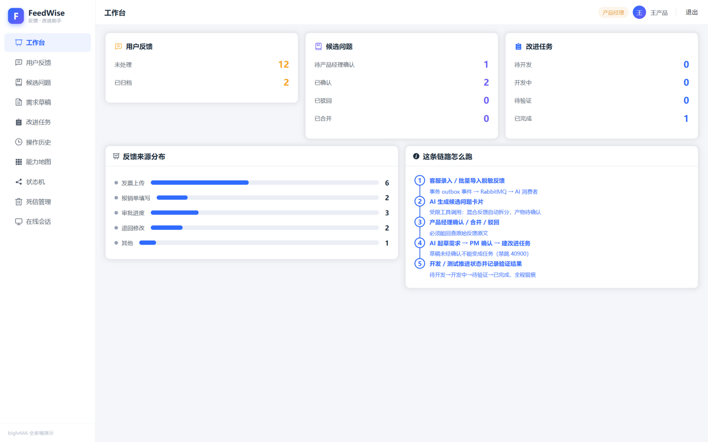
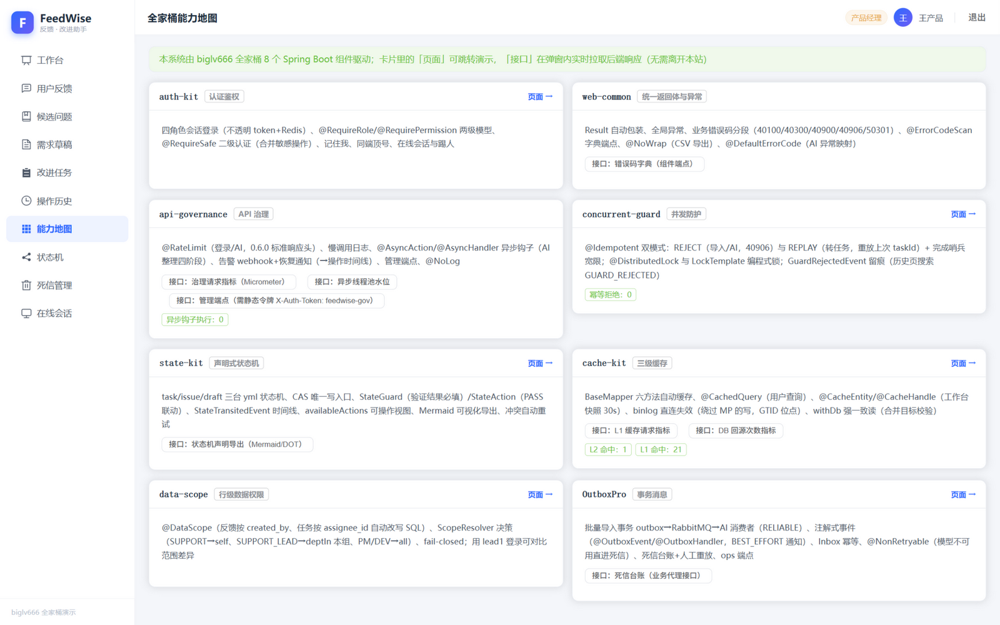
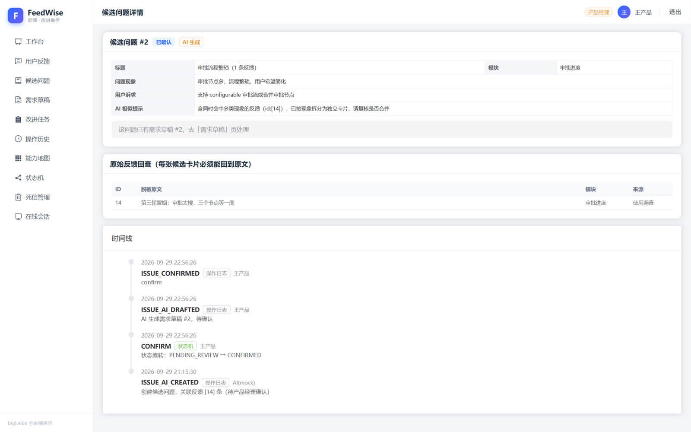
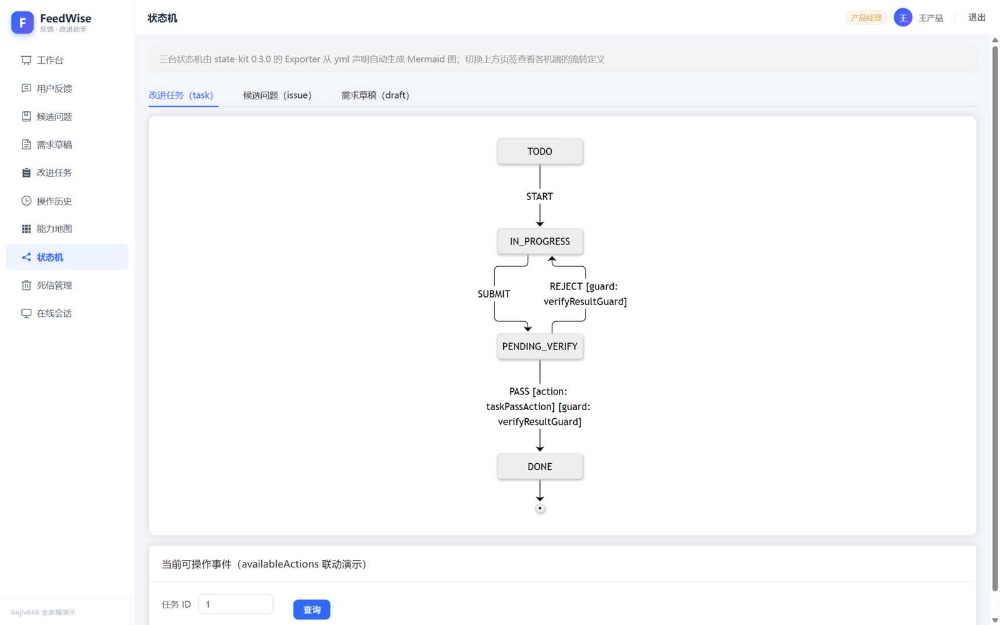
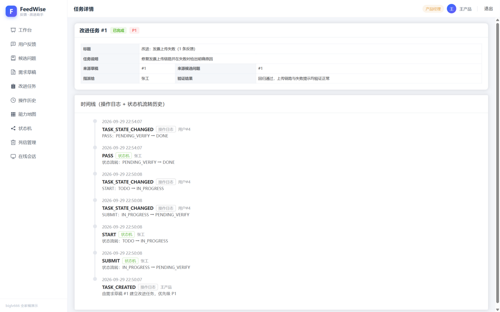

# FeedWise · 企业报销软件「用户反馈与功能改进助手」

> 把零散的用户反馈，经 **AI 约束式整理 → 产品经理确认**，变成可交给开发的**功能改进任务**——
> 全程状态受控、数据权限受控、每一步可回查原文与留痕。
>
> 后端是 **[biglv666 全家桶](https://github.com/BIGLV666) 8 个 Spring Boot 组件的整合演示**：
> 每个组件都在业务里承担真实职责，不是"引了依赖"，而是"用了能力"。
> 前端 Vue 3 + Vite + Element Plus（14 个页面），基础设施 MySQL 8.4 + Redis 7 + RabbitMQ 3（docker compose 一键起）。



## 目录

- [1. 这是什么 / 展示什么](#1-这是什么展示什么)
- [2. 业务场景与角色](#2-业务场景与角色)
- [3. 主业务链路](#3-主业务链路)
- [4. AI 的边界：受限工具调用](#4-ai-的边界受限工具调用)
- [5. 状态机与状态约束](#5-状态机与状态约束)
- [6. 全家桶组件映射（8/8）](#6-全家桶组件映射-88)
- [7. 快速开始（新环境可复现）](#7-快速开始新环境可复现)
- [8. 页面清单（14 个）](#8-页面清单14-个)
- [9. 测试与质量](#9-测试与质量)
- [10. 目录结构](#10-目录结构)
- [11. 设计文档](#11-设计文档)

## 1. 这是什么 / 展示什么

一句话：**一个自研组件生态的"验收现场"**。全家桶里每个 starter 单独测试都是全绿的，
但组件与组件之间、组件与业务框架之间的"咬合处"才是真实工程风险所在——这个项目用一条完整的业务链路
把它们串起来跑，并留下可复现的验证方式。

具体展示：

| 展示点 | 在哪看 |
|---|---|
| 8 个组件各自的能力清单 + 实时运行指标 + 接口现场演示 | 前端「全家桶能力地图」页（`/capability`） |
| 状态机声明可视化（Mermaid，从 yml 声明自动生成，标注 guard/action） | 「状态机」页（`/machines`） |
| 一条从录入到验证完成的真实链路（AI 异步整理、PM 决策、DEV 推进） | `docs/DEMO.md` 十分钟演示脚本 |
| 数据权限矩阵（四角色 × 行级范围 × 权限位） | 用 support1 / lead1 / pm / dev1 分别登录对比 |
| 死信台账与人工重放（模型不可用 → 直进死信 → 修复后重放） | 「死信管理」页（`/dlq`） |
| 在线会话与踢人下线（顶号=BE_REPLACED / 被踢=KICKED_OUT 语义区分） | 「在线会话」页（`/sessions`） |
| 测试揪出的真实缺陷与修复过程 | `docs/TEST-REPORT.md` |



## 2. 业务场景与角色

一家开发企业报销软件的科技公司，一周收到 60 条用户反馈：有人说"上传发票总是失败"，
有人说"找不到报销单退回原因"，还有人只写了一句"审批太麻烦"。同一个问题被不同用户用不同方式表达，
一条反馈里也可能同时包含多个问题。系统让 AI 完成第一轮整理，把**所有决策权留给产品经理**。

| 角色 | 账号（密码均 123456） | 能做 | 不能做 |
|---|---|---|---|
| 客服 SUPPORT | support1 / support2 | 录入/批量导入脱敏反馈、查看自己录入的反馈 | 确认问题、定优先级、建任务（→40300） |
| 客服主管 SUPPORT_LEAD | lead1 | 查看本组（同 dept）客服的反馈、导出 CSV、手工建卡 | 确认问题、定优先级、建任务（→40300） |
| 产品经理 PM | pm | 触发 AI、确认/合并/驳回、改草稿、建任务、定优先级、死信重放 | 修改/删除任何反馈原文（接口不存在） |
| 开发/测试 DEV | dev1 | 任务状态流转、记录验证结果 | 需求确认、建任务（→40300） |

权限是两级模型：`@RequireRole` 管角色入口，`@RequirePermission` 管细粒度权限位
（`issue:confirm` / `issue:merge` / `draft:convert` / `feedback:export` / `dlq:replay`）；
行级数据范围由 data-scope 按 `ScopeResolver` 决策自动改写 SQL（fail-closed）。

## 3. 主业务链路

```
客服录入/导入脱敏反馈
  └─ 事务 outbox 事件 → RabbitMQ → AI 消费者（RELIABLE，可重试/死信）——反馈数据零丢失
AI 按「功能模块 + 问题现象」聚类，生成候选问题卡片
  ├─ 混合反馈（同时含多个现象）自动拆成多张卡，并提示 PM"请复核是否合并"
  └─ 命中不了的反馈保持未处理，留给人工分类——AI 不硬猜
产品经理逐条查看原文回查，确认 / 驳回 / 合并（合并是敏感操作：二级认证 + 编程式锁）
AI 为已确认问题生成需求草稿和验收条件（草稿未经确认不能变成任务：禁跳 40900）
产品经理确认草稿 → 建立改进任务（REPLAY 幂等：重复提交重放同一任务，不重复建）
开发/测试推进 待开发→开发中→待验证→已完成（验证结果必填，由状态机守卫强制；不通过可退回）
  └─ 全程时间线 = 操作日志（谁/何时/说明了什么）+ 状态机流转历史（双源合并查询）
```



## 4. AI 的边界：受限工具调用

这个项目里 AI **不是自由发挥的文本生成器**，而是一个只能调用白名单工具的受约束执行者：

- **工具白名单**：AI 只能调用 `create_candidate_issue`（建候选卡）与 `draft_requirement`（起草需求）两个工具，
  未注册的工具名一律拒绝（业务层的"第二道闸门"是每个工具实现内强制的业务红线）。
- **Schema 校验**：工具入参先过 JSON Schema（类型/长度/枚举/数组下限），结构不合格直接拒绝，不给业务代码喂脏数据。
- **产物一律是草稿**：AI 生成的卡片固定 `PENDING_REVIEW + ai_generated=1`，草稿固定 `DRAFT`——
  没有任何 AI 路径能产出"已生效"数据。
- **AI 无合并/无优先级/无删改原文能力**：合并只能由 PM 手工执行（前端还要二级认证）；
  "含义不同但关键词相似"的反馈永远不会被自动合并（聚类按"现象指纹"而非关键词）。
- **双引擎同协议**：默认 `mock` 引擎（离线确定性规则，测试与演示零外部依赖）与
  `openai` 兼容引擎（真实 function calling）走**完全相同**的工具调用协议。
- **模型不可用自动降级**：同步触发返回 50301 提示改手工；事件通道靠 `@NonRetryable` 直进死信，
  等模型恢复后 PM 在死信页人工重放。任何情况下反馈数据零丢失、手工路径闭环可用。

## 5. 状态机与状态约束

所有对象的状态只有一个写入口——state-kit 的 CAS 条件更新；非法流转一律 `40900`，
且错误信息会把"当前可尝试事件"一并告诉你：

| 对象 | 状态与合法流转 | 典型禁跳（→40900） |
|---|---|---|
| 反馈 | UNPROCESSED → PROCESSED（被候选卡关联） | — |
| 候选问题 | 待确认 → 确认 / 驳回 / 合并（唯一出边集合） | 已驳回→确认、已确认→驳回 |
| 需求草稿 | DRAFT → CONFIRMED → CONVERTED | 草稿未确认直接转任务 |
| 改进任务 | 待开发 → 开发中 → 待验证 → 已完成；待验证可退回开发中 | 待开发→已完成、已完成→任意 |



状态机扩展点也在用：`verifyResultGuard`（PASS/REJECT 验证结果必填，守卫在 CAS 前拦截）、
`taskPassAction`（验证通过后同事务联动写回候选问题时间线）、`StateTransitedEvent`
（AFTER_COMMIT 旁路统一记录流转）、`availableActions`（前端按钮由状态机实时返回，而非写死）。

## 6. 全家桶组件映射（8/8）

| 组件 | 在本项目中的用途 |
|---|---|
| **auth-kit** | 四角色会话登录（不透明 token + Redis）、`@RequireRole`+`@RequirePermission` 两级模型、`@RequireSafe` 二级认证（合并敏感操作）、记住我、同端顶号、在线会话与强制下线（顶号/被踢语义区分） |
| **web-common** | 统一 Result + 全局异常 + 错误码分段（40100/40300/40900/40906/50301）、错误码字典端点、`@NoWrap`（CSV 流式导出）、`@DefaultErrorCode`（AI 异常映射） |
| **api-governance** | 限流（0.6.0 标准响应头）、慢调用日志、`@AsyncAction/@AsyncHandler` 异步钩子（AI 整理四阶段旁路观察）、告警 webhook + 恢复通知（写入操作时间线）、管理端点、`@NoLog` |
| **concurrent-guard** | `@Idempotent` 双模式：REJECT（导入/AI 触发，40906）+ REPLAY（转任务，重放上次 taskId）+ 完成哨兵宽限；`@DistributedLock` 与 `LockTemplate` 编程式锁（合并）；`GuardRejectedEvent` 留痕 |
| **state-kit** | 三台状态机：CAS 唯一写入口、流转历史、`StateGuard`/`StateAction` 扩展点、`StateTransitedEvent` 时间线、`availableActions` 可操作视图、Mermaid 可视化导出、冲突自动重试 |
| **cache-kit** | 三级缓存：MP BaseMapper 自动缓存、`@CachedQuery`、`@CacheEntity`+`@CacheHandle`（工作台快照 30s）；binlog 直连失效（GTID 位点）兜底"绕过 MP 的写"（状态机 CAS 直写/手工改库）；`withDb` 强一致读 |
| **data-scope** | 行级权限：SUPPORT→self、SUPPORT_LEAD→deptIn 本组、DEV→被指派任务、PM→all（SQL 自动改写，fail-closed） |
| **OutboxPro** | 导入事务 outbox → RabbitMQ → AI 消费者（RELIABLE + Inbox 幂等）；`@OutboxEvent/@OutboxHandler` 注解式 BEST_EFFORT 通知；`@NonRetryable` 直进死信；死信台账 + 人工重放（权限位判权） |

**依赖消费策略**：`pom.xml` 经 JitPack（`com.github.BIGLV666:...:<commit-sha>`）锁定各组件最新 main 提交——
组件日常迭代走 JitPack，Maven Central 只发大版本（BOM：`io.github.biglv666:biglv666-spring-boot-bom`）。

## 7. 快速开始（新环境可复现）

前置：JDK 21、Maven 3.9+、Node 18+、Docker。

```bash
# ① 基础设施（MySQL 8.4 + Redis 7 + RabbitMQ 3；首次启动自动建表 + 演示数据）
docker compose up -d
# 端口：MySQL 3310（root/root，库 feedwise，GTID 开启）、Redis 6381、RabbitMQ 5672 / 管理台 15672

# ② 后端
mvn spring-boot:run                      # 默认 8080；被占用时 SERVER_PORT=8081 mvn spring-boot:run

# ③ 前端
cd frontend && npm install
BACKEND_PORT=8081 npm run dev            # http://localhost:5173（backend 端口按实际填）
```

打开 <http://localhost:5173>，登录页提供演示账号一键填充（五个账号覆盖四角色）。
完整演示脚本（含 curl 版全链路与反制演示）见 [`docs/DEMO.md`](docs/DEMO.md)。

## 8. 页面清单（14 个）

| 页面 | 看点 |
|---|---|
| 登录 | 记住我（7 天免登录）、五个演示账号一键填充 |
| 工作台 | 状态分布统计（`@CacheHandle` 30s 快照）、模块分布、链路步骤图 |
| 用户反馈 | 录入 / 批量导入 / 触发 AI / 导出 CSV（范围随行级权限收敛） |
| 反馈详情 | 原文（不可改删）+ 归属卡片 + 时间线 |
| 候选问题 | 列表（AI/手工标记、相似提示）+ 手工建卡（模型不可用兜底） |
| 候选问题详情 | 原文回查、确认/驳回、合并（二级认证）、AI 起草 |
| 需求草稿 | 查看/编辑（仅 DRAFT）、确认、转任务（REPLAY 幂等） |
| 改进任务 | 状态分区看板 |
| 任务详情 | 按钮来自 `availableActions`、验证结果必填、双源时间线 |
| 操作历史 | 按对象检索时间线（含 GUARD_REJECTED 拦截留痕） |
| **能力地图** | 8 组件卡片：能力清单 + 实时指标 + 接口弹窗现场演示 |
| **状态机** | 三台机器 Mermaid 图 + 可操作事件查询 |
| **死信管理** | 死信台账（原因分类/重放次数）+ 人工重放 |
| **在线会话** | 会话列表（token 脱敏）+ 强制下线 + 本机会话保护 |

反馈形态全覆盖：loading 骨架、空数据插画、成功/失败 Message、40900 冲突弹条、
40906 重复提交提示、40300/40904 无权限提示、401 按语义展示（顶号/被踢/超时）。



## 9. 测试与质量

```bash
mvn test    # 35 用例全绿（H2 + mock AI；含主链路集成、权限矩阵、状态机禁跳、AI 约束、幂等、缓存、导出）
```

覆盖矩阵：主链路 7 步集成、角色/权限/归属矩阵、状态机禁跳与守卫、AI 受限工具与降级、
REPLAY/REJECT 幂等语义、deptIn 范围、CSV 权限、缓存命中与失效、`availableActions`。

测试与真机验证过程揪出过若干**真实缺陷**（详见 [`docs/TEST-REPORT.md`](docs/TEST-REPORT.md)）：
批量导入事件携带 null 主键（只有真机 outbox 链路能暴露）、三个详情页白屏（miss import）、
initdb 字符集乱码、状态机 CAS 与缓存失效的组合盲区等——"组件单独绿 ≠ 组合正确"。

## 10. 目录结构

```
FeedWise/
├── src/main/java/com/feedwise/
│   ├── ai/                # AI 编排器 + 受限工具（白名单 + Schema 校验 + 业务红线）+ mock/openai 双引擎
│   ├── config/            # auth-kit SPI / data-scope 决策 / state-kit / OutboxPro 事件与授权器
│   ├── controller/        # 14 个 Controller（角色 + 权限位声明）
│   ├── service/           # 业务核心（反馈/候选问题/草稿/任务/时间线/工作台）
│   ├── integration/       # OutboxPro 事件与消费者、state-kit 扩展点、guard 事件、治理钩子
│   └── common/            # 错误码分段 + guard 异常映射 + 当前用户工具
├── src/main/resources/Sql/    # 01_schema.sql + 02_data.sql（compose 首启按序自动执行）
├── frontend/                  # Vue 3 + Vite + Element Plus（14 页面）
├── docker-compose.yml         # MySQL(3310,GTID) + Redis(6381) + RabbitMQ(5672)
└── docs/                      # 设计清单 / 扩展清单 / 测试报告 / 演示脚本
```

## 11. 设计文档

- [`docs/DESIGN.md`](docs/DESIGN.md) —— 架构先行清单（对象/状态/链路/页面/组件映射/不采用的方案与理由）
- [`docs/DESIGN-EXPAND.md`](docs/DESIGN-EXPAND.md) —— 能力铺满清单（REPLAY/二级认证/deptIn/DLQ 重放/异步钩子/状态机扩展点）
- [`docs/TEST-REPORT.md`](docs/TEST-REPORT.md) —— 测试结果、真机验证与缺陷修复记录
- [`docs/DEMO.md`](docs/DEMO.md) —— 十分钟核心演示脚本（含反制演示与 curl 版）